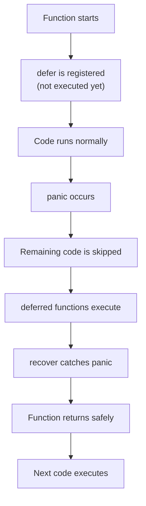

# 🛑 Defer, Panic, and Recover

> [!NOTE]
> ## 📖 Before You Begin
>
> If **`defer`**, **`panic`**, and **`recover`** feel confusing at first, don't worry—that's completely normal.
>
> These are some of the first Go concepts that change **how you think about program execution**, so it's common for beginners to find them a little overwhelming.
>
> The good news is that each concept is actually **simple on its own**. The confusion usually comes from trying to understand all three together.
>
> **Take your time.** Read each section in order, run the examples on your machine, and try to predict the output before looking at the answer.
>
> By the end of this guide, you'll understand:
>
> - ✅ What `defer` does and why it's useful
> - ✅ When to use `panic`
> - ✅ How `recover` prevents a program from crashing
> - ✅ How `defer`, `panic`, and `recover` work together
>
> **Don't try to memorize everything.** Focus on understanding the idea behind each concept—the syntax will become natural with practice.


## 📌 Quick Summary

Before we dive into the details, here's a simple way to think about these three keywords.

| Keyword | Think of it as... |
|----------|-------------------|
| **`defer`** | "Do this later, just before leaving the function." |
| **`panic`** | "Something went seriously wrong, so stop normal execution." |
| **`recover`** | "Catch the panic so the program can continue safely." |

> 💡 **Don't worry if these definitions don't make complete sense yet.**
> We'll understand each one step by step with examples.

---

# 🤔 Predict the Output — Learn by Thinking First

Before looking at the output of each example, take a moment to **predict what will happen**.

This is not a test. You don't need to get every answer correct.

The goal is to train your brain to understand **how Go executes code**.

When you predict first, you start thinking like the Go runtime:

- What code runs immediately?
- What code gets delayed?
- What happens when an error occurs?
- Which function executes first?
- Which code gets skipped?

---

## Why Predict Before Seeing the Answer?

Many beginners read code like this:

```
Read code
     ↓
See output
     ↓
Move on
```

But this often creates a problem:

You remember the example, but you don't understand **why** it happened.

A better approach is:

```
Read code
     ↓
Make a prediction
     ↓
Run the code
     ↓
Compare your answer
     ↓
Understand the reason
```

This small habit helps you build a stronger programming mindset.

---

# Example Learning Pattern

Throughout this guide, examples will follow this structure:

```
## Example

🤔 Predict the Output

(Code)

⏸️ Stop and Think

(Your prediction)

✅ Output

(Actual result)

💡 Why?

(Explanation)
```

---

## Example Preview

Before learning `defer`, imagine seeing this:

```go
package main

import "fmt"

func main() {

    fmt.Println("Start")

    defer fmt.Println("End")

    fmt.Println("Middle")
}
```

Before running it, ask yourself:

- Does `"End"` print immediately?
- Does `"End"` print before `"Middle"`?
- What is the final order?

Only after making a prediction should you check the answer.

---

> 💡 **Remember**
>
> Programming is not only about knowing syntax.
>
> It is about building a mental model of how the computer executes your instructions.

---

Now let's start with our first concept:

---

## What is `defer`?

`defer` is a Go keyword that **delays the execution of a function call** until the surrounding function is about to return.

In simple words:

> `defer` means **"remember this code and run it later when this function finishes."**

The important thing to understand is:

- The deferred function is **registered immediately**.
- The deferred function is **not executed immediately**.
- It runs only when the current function is about to finish.

---

## Syntax

```go
defer functionCall()
```

Example:

```go
defer fmt.Println("Hello")
```

This does **not** print `"Hello"` immediately.

Go remembers it and executes it later when the function returns.

**example:**

```go
package main

import "fmt"

func main() {

    fmt.Println("1. Start")

    defer fmt.Println("3. This runs last")

    fmt.Println("2. Middle")

}
```
Remember:

`defer` is written in the middle of the function, but it does not execute at that moment.


## Output

```text
1. Start
2. Middle
3. This runs last
```

---

# Why Use `defer`?

Now we know that `defer` delays execution until a function finishes.

But why would we want to delay something?

The main reason is:

> **`defer` is commonly used for cleanup operations.**

In programming, we often create resources that must be released after we finish using them.

Examples:

- Opening a file → Close the file
- Creating a database connection → Close the connection
- Locking a resource → Unlock it
- Allocating memory/resources → Release them

Without `defer`, we have to remember to clean everything up manually.

That can become difficult, especially when a function has multiple exit points.

---

# Why Is This Powerful?

Even if something unexpected happens later:

```go
func readFile() {

    file, err := os.Open("data.txt")

    if err != nil {
        return
    }

    defer file.Close()

    panic("Something went wrong")

}
```

The deferred cleanup still runs before the program handles the panic.

This makes programs safer and prevents resource leaks.

---

# Multiple `defer` Statements

So far, we have seen only one `defer` statement.

But in real programs, a function can have **multiple cleanup tasks**.

For example:

- Close a file
- Release a lock
- Close a database connection

Go allows us to use multiple `defer` statements inside the same function.

But there is an important rule:

> **Multiple deferred functions execute in reverse order.**

This means:

> **The last `defer` added is the first one executed.**

This is called:

## LIFO — Last In, First Out

---

# 🤔 Predict the Output

Before looking at the answer, try to predict:

- Which defer runs first?
- Does the first `defer` execute before the second one?
- What will be the final output order?

```go
package main

import "fmt"

func main() {

    fmt.Println("1. Start")

    defer fmt.Println("2. First defer")
    defer fmt.Println("3. Second defer")
    defer fmt.Println("4. Third defer")

    fmt.Println("5. End")
}
```

---

🎉 Great! You now understand the complete behavior of `defer`.

Next, we will learn what happens when a program encounters a serious problem using **`panic`**.

---

# Understanding `panic`

So far, we have learned how Go handles normal execution using `defer`.

But programs don't always run perfectly.

Sometimes something happens that makes it impossible for the program to continue safely.

For those situations, Go provides:

```go
panic()
```

---

## What is `panic`?

`panic` is a mechanism in Go that **stops normal program execution immediately**.

In simple words:

> `panic` means: "Something went seriously wrong, and the program cannot safely continue."

When a panic occurs:

1. The current function stops executing.
2. Remaining code in that function is skipped.
3. Deferred functions are executed.
4. Go searches for a `recover()` function.
5. If no recovery happens, the program crashes.

---

## Syntax

```go
panic("error message")
```

Example:

```go
panic("Something went wrong!")
```

The value passed to `panic()` is printed as the error message.

---

# 🤔 Predict the Output

Before looking at the output, think about these questions:

- Will `"Program started"` be printed?
- Will `"This code will never run"` execute?
- What happens immediately after `panic()`?

```go
package main

import "fmt"

func main() {

    fmt.Println("Program started")

    panic("Something went wrong!")

    fmt.Println("This code will never run")
}
```

---

Remember:

`panic()` changes the normal flow of execution.

## ✅ Output

```text
Program started

panic: Something went wrong!

goroutine 1 [running]:
main.main()
/path/to/file.go:10 +0x40
exit status 2
```
## Go starts panic handling

Before terminating the program, Go:

1. Runs deferred functions.
2. Checks whether any `recover()` exists.
3. If no recovery exists, the program crashes.

---

# Execution Flow of `panic`

```text
Function starts
       |
       ▼
Normal code runs
       |
       ▼
panic() happens
       |
       ▼
Remaining code is skipped
       |
       ▼
defer functions execute
       |
       ▼
recover() found?
       |
   ┌───┴───┐
   │       │
 Yes      No
   │       │
   ▼       ▼
Continue  Program crashes
```

# When Should We Use `panic`?

`panic` should be used only for situations where the program **cannot continue safely**.

Examples:

### 1. Invalid Program State

The program reaches a situation that should never happen.

Example:

```go
if config == nil {
    panic("configuration missing")
}
```

---

### 2. Critical Resource Failure

A required resource is unavailable.

Example:

```go
if databaseConnection == nil {
    panic("database connection unavailable")
}
```

---

### 3. Programming Mistakes

An unexpected condition caused by a bug.

Example:

```go
if value < 0 {
    panic("invalid value")
}
```

---


# Example: Division by Zero

Let's see a practical example.

```go
package main

import "fmt"

func divide(a, b int) {

    if b == 0 {
        panic("Cannot divide by zero!")
    }

    result := a / b
    fmt.Println("Result:", result)
}

func main() {

    divide(10, 2)

    divide(10, 0)
}
```

---

## ✅ Output

```text
Result: 5

panic: Cannot divide by zero!

...
exit status 2
```

---

Next, we will learn how Go allows us to **catch and handle a panic safely** using `recover()`.

---

# Understanding `recover`

We have seen that `panic` stops normal program execution.

But what if we want to **catch that panic** and prevent the program from crashing?

Go provides:

```go
recover()
```

`recover` allows us to regain control of a program after a panic occurs.

---

## What is `recover`?

`recover` is a built-in Go function that:

- Catches a panic
- Stops the program from crashing
- Allows us to handle the situation gracefully

In simple words:

> `recover` means: "A panic happened, but I know how to handle it."

---

## Important Rule ⚠️

`recover()` only works inside a deferred function.

This is the most important rule to remember.

```go
defer func() {

    recover()

}()
```

Recover function will return `panic text` if panic occurred, if not it will return `nil`      (special type in go)

## Syntax

The common pattern is:

```go
defer func() {

    if r := recover(); r != nil {
        fmt.Println("Recovered:", r)
    }

}()
```

**example:**

```go
package main

import "fmt"

func main() {

    fmt.Println("Program started")

    defer func() {

        if r := recover(); r != nil {
            fmt.Println("Caught panic:", r)
        }

    }()

    panic("Something went wrong!")

    fmt.Println("This line is skipped")
}
```

---

Remember:

Even during a panic, Go still executes deferred functions.

---

## ✅ Output

```text
Program started
Caught panic: Something went wrong!
```

---


# Real-World Usage of `recover`

`recover` is commonly used in places where a panic should not bring down the entire application.

Examples:

- Web servers handling one bad request
- Background workers
- Goroutines
- Framework-level error handling

Example:

A web server receives 1000 requests.

One request causes a panic.

Without recovery:

```
Server crashes ❌
```

With recovery:

```
One request fails
        |
        ▼
Recover panic
        |
        ▼
Server continues ✅
```

---

# Part 4 — How `defer`, `panic`, and `recover` Work Together

Now we understand each concept individually:

| Keyword | Purpose |
|---------|---------|
| `defer` | Delays execution until the function finishes |
| `panic` | Stops normal execution when something goes seriously wrong |
| `recover` | Catches a panic and prevents the program from crashing |

Now let's see how they work together.

The relationship is:

```
defer
  |
  ▼
Prepare cleanup/recovery code

panic
  |
  ▼
Interrupt normal execution

recover
  |
  ▼
Catch the panic inside defer
```

---


# Complete Execution Flow

When a panic happens, Go follows a specific order.



---

# Example: Combining All Three

```go
package main

import "fmt"

func riskyOperation() {

    fmt.Println("Operation started")

    panic("Something went wrong!")

}

func main() {

    defer func() {

        if r := recover(); r != nil {

            fmt.Println("Recovered:", r)

        }
    }()
 riskyOperation()
 fmt.Println("Program completed")

}
```

---

# Key Differences

| Feature | `defer` | `panic` | `recover` |
|---------|---------|---------|-----------|
| Purpose | Delay execution | Stop execution | Handle panic |
| Runs when | Function returns | Immediately | During deferred execution |
| Common usage | Cleanup | Critical failures | Prevent crashes |
| Should be used | Frequently | Rarely | Carefully |

---

# Please Note & Keep in mind

`recover()` only works inside a deferred function, but that deferred function must be registered before the panic happens.

# 🎉 Congratulations!

You now understand one of Go's most important execution patterns:

```
defer → cleanup
panic → emergency stop
recover → safe handling
```

These three concepts appear frequently in real Go applications, especially when working with:

- Files
- Databases
- Servers
- Goroutines
- Resource management

The more Go code you read, the more natural these patterns will become.

# 💡 Memory Points

1. **Defer** = Delay execution until function ends (perfect for cleanup)
2. **Syntax** = `defer functionCall()`
3. **Order** = Multiple defers execute in LIFO order (last declared, first executed)
4. **Panic** = Fatal error that crashes program
5. **When to panic** = Critical errors only
6. **Recover** = Catch panic inside defer statement
7. **Recover syntax** = `if r := recover(); r != nil { ... }`
8. **Execution** = Panic stops code → defer runs → recover catches panic
9. **Use defer for** = File closing, resource release, lock management
10. **Use panic for** = Critical errors that cannot be recovered

---


